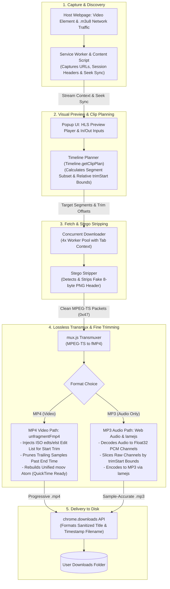

# StreamSnip - Lossless HLS Video & Audio Clipper

[](LICENSE)
[](package.json)
[](CONTRIBUTING.md)

**Snip before you download.** StreamSnip is a standalone Google Chrome Extension (Manifest V3) that intercepts HLS (`.m3u8`) streaming video, provides an interactive in-browser preview player, and lets you clip and download exact time ranges losslessly with sub-second precision - without re-encoding a single frame.

---

## Why StreamSnip?

| Scenario                                  | Typical Downloaders                                     | StreamSnip                                           |
| :---------------------------------------- | :------------------------------------------------------ | :--------------------------------------------------- |
| **Download a 30s clip from a 2hr stream** | Forces downloading all 2 hours (4+ GB)                  | Downloads only the requested 30s (~20 MB)            |
| **Trimming Precision**                    | Coarse 5-10s segment boundaries, or slow WASM re-encode | Sub-second accuracy, zero re-encode, instant save    |
| **Disguised / Image-Wrapped Streams**     | Fails with corrupted files or "no media found"          | Auto-detects and strips fake PNG headers in memory   |
| **macOS QuickTime & iOS Playback**        | Glitches or refuses to open fragmented fMP4             | 100% compatible progressive MP4 with unified `moov`  |
| **Audio-Only Export**                     | Requires external video converter software              | 1-click sample-accurate MP3 export via Web Audio     |
| **Privacy & Security**                    | May route streams through cloud servers                 | 100% client-side, zero cloud proxies, zero telemetry |

---

## Key Features

- **Lossless Zero-Reencode Fine Trimming**: Employs container-level ISO/IEC 14496-12 Edit Lists (`edts`/`elst`) and sample pruning. Video hardware decoders skip directly to your exact start timecode without re-encoding keyframes, preserving 100% source resolution and bitrate.
- **In-Flight Steganography Stripping**: Transparently detects disguised HLS segments (such as MPEG-TS packets prepended with fake 8-byte PNG image headers) and recovers raw sync bytes (`0x47`) in real time.
- **Progressive MP4 Unfragmenting**: Reconstructs fragmented MP4 streams (`moof` + `mdat`) into classic progressive files with complete sample tables (`stts`, `stss`, `ctts`, `stsz`, `stsc`, `stco`) for flawless compatibility with macOS QuickTime Player, iOS, and desktop video editors.
- **Interactive Preview & Page Seek Sync**: Embedded HLS preview player allows visual range selection. Automatically synchronizes playhead positions with video players on the host page (even inside nested Shadow DOM roots).
- **Frame-Accurate MP3 Extraction**: Decodes audio tracks directly in the browser, slices raw Float32 PCM channels to your exact millisecond boundaries, and encodes to MP3 via `lamejs`.
- **Smart Filename Detection**: Extracts the webpage document title, sanitizes illegal characters, detects video production codes, and automatically generates clean timestamped filenames (e.g., `TITLE-01_03_00-01_18_00.mp4`).
- **Side Panel & Focused Download Mode**: Docks alongside your browser tabs for seamless previewing, or opens a dedicated download tab (`mode=download`) for background processing without UI lockup.

---

## Data Flow Architecture

The end-to-end processing pipeline runs strictly inside your local browser sandbox:



---

## Project Structure

```
stego-clip-extension/
├── background/
│   └── service_worker.js     # Intercepts M3U8 requests and manages session headers
├── content/
│   └── content.js            # Observes Shadow DOM video elements and reports seek events
├── lib/
│   ├── bytes.js              # High-performance typed array buffer concatenation
│   ├── constants.js          # Shared message types, storage keys, and safety bounds
│   ├── downloader.js         # Concurrent segment fetcher and stego stripper
│   ├── mp3-encoder.js        # Web Audio PCM channel slicer and lamejs MP3 encoder
│   ├── parser.js             # M3U8 playlist parser and Timeline.getClipPlan
│   ├── stego-loader.js       # Hls.js fragment loader adapter
│   ├── stego.js              # Binary inspection and PNG header stripper
│   ├── time.js               # Timestamp parsing, formatting, and filename generation
│   └── transmuxer.js         # TS-to-MP4 transmuxer, edts/elst builder, and unfragmenter
├── popup/
│   ├── player-controller.js  # Hls.js lifecycle, metadata extraction, and preview control
│   ├── popup.css             # Extension styling, range inputs, and toast alerts
│   ├── popup.html            # Extension layout, media inspector, and download manager
│   ├── popup.js              # Coordinator wiring clip planning to downloads
│   ├── state-manager.js      # Debounced, tab-isolated storage synchronization
│   └── ui-feedback.js        # Non-blocking inline notifications
├── types/
│   └── domain.d.ts           # Strict TypeScript ambient types and domain contracts
├── tests/                    # Automated unit test suite (70 tests)
├── jsconfig.json             # TypeScript checkJs configuration
└── manifest.json             # Manifest V3 extension configuration
```

---

## Installation in Google Chrome

### From Source (Developer Mode)

1. Clone this repository:
   ```bash
   git clone https://github.com/dev-ansung/stego-clip-extension.git
   ```
2. Open Google Chrome and go to `chrome://extensions`.
3. Toggle on **Developer mode** in the top-right corner.
4. Click **Load unpacked** in the top-left corner.
5. Select the `stego-clip-extension` directory.

### From Release Package

1. Download the latest `stego-clip-extension-v*.zip` from GitHub Releases.
2. Unzip the package into a local directory.
3. In `chrome://extensions` with **Developer mode** enabled, click **Load unpacked** and select the unzipped folder.

---

## Usage

1. Open any webpage playing an HLS (`.m3u8`) video stream.
2. Click the **StreamSnip** extension icon in your Chrome toolbar (or open the Chrome Side Panel).
3. The detected video stream loads into the preview player automatically.
4. Scrub the preview or the host webpage player to locate your desired start and end points.
5. Click **⏱️ Current** to lock in your start and end times (or type timestamps manually as `MM:SS` or `HH:MM:SS`).
6. Select your output format (`MP4`, `TS`, or `MP3`) and click **⬇️ Download Clip**.
7. The trimmed media file saves directly to your browser's default Downloads folder.

---

## Development & Verification

StreamSnip enforces strict multi-tier verification including TypeScript `checkJs` type checking, ESLint, Prettier, and automated tests.

Install dependencies:

```bash
pnpm install
```

Run type checking:

```bash
pnpm run typecheck
```

Run the unit test suite (70 tests):

```bash
pnpm test
```

Run the complete verification pipeline (Typecheck + Lint + Prettier Check + Tests):

```bash
pnpm run check
```

Automatically format code style:

```bash
pnpm run format
```

Build a standalone distribution ZIP for release:

```bash
pnpm run build
```

---

## Sister Project

Looking for a Python CLI tool for terminal-based and batch downloads with referer spoofing and segment concurrency? Check out:

- [stego-hls](https://github.com/dev-ansung/stego-hls) - Open source CLI to download and decrypt stego HLS streams with segmented downloading.

---

## Contributing

Contributions are welcome! Please check out [CONTRIBUTING.md](CONTRIBUTING.md) for guidelines on code style, testing, and pull requests.

---

## License

This project is licensed under the MIT License - see the [LICENSE](LICENSE) file for details.
